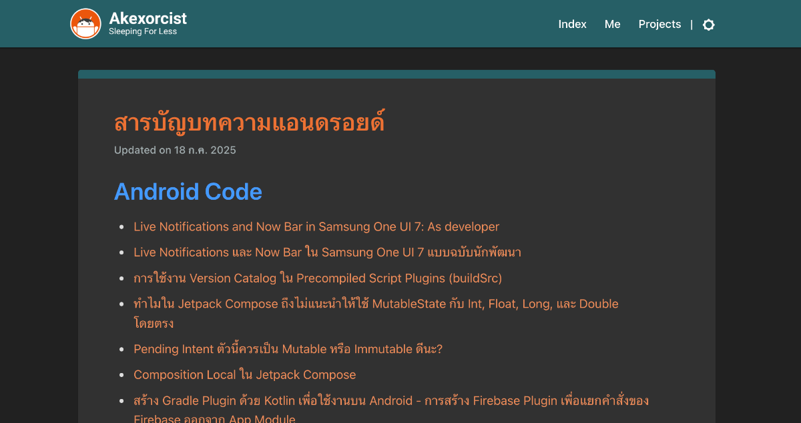

# Akexorcist Index Updater

A Kotlin Multiplatform server for automating the update of an index article on a Ghost blog. It listens for webhook events, fetches and parses post content, and updates a designated index post with a formatted summary of posts by tag.



See an example at [akexorcist.dev's article index](https://akexorcist.dev/android-article-index/)

## Features
- Webhook endpoint with IP and credential verification
- Fetches posts from Ghost CMS via Content API
- Groups and formats posts by tag
- Updates a target index post using the Admin API
- Modular, testable architecture with Koin DI
- Comprehensive unit and integration tests

## Requirements
- JDK 17 or higher
- [Ghost CMS](https://ghost.org/) instance
- API keys for Ghost Content and Admin APIs

## Setup
1. **Clone the repository:**
   ```sh
   git clone https://github.com/your-username/akexorcist-index-updater.git
   cd akexorcist-index-updater
   ```
2. **Create a `.env` file in the `server/` directory:**
   ```env
   GHOST_API_URL=https://<your_ghost_blog>/ghost/api
   GHOST_ADMIN_API_KEY=your_admin_api_key
   GHOST_CONTENT_API_KEY=your_content_api_key
   INDEX_POST_ID=your_index_post_id
   ALLOWED_IPS=127.0.0.1,123.456.789.012
   TAG_WHITELIST=Kotlin,Backend
   VERIFICATION_PASSPHRASE=your_webhook_secret
   ```
   **Never commit your `.env` file or secrets to version control.**

## Running the Server
From the project root:
```sh
./gradlew :server:jvmRun
```
The server will start on port 3000 by default. You can specify a different port:
```sh
./gradlew :server:jvmRun --args='8080'
```

## Testing
Run all unit and integration tests:
```sh
./gradlew allTests
```
Or JVM-specific tests:
```sh
./gradlew jvmTest
```

## Deployment
Deployment is automated via GitHub Actions when you push a tag starting with `v` (e.g., `v1.0.0`). The workflow will run tests, build the JAR, and deploy it to the `deploy` branch.

### Manual Distribution
To build a distributable JAR file manually, run:
```sh
./gradlew shadowJar -PappVersion="<app_version>"
```
The JAR will be located in `server/build/libs/`.

- Place your `.env` file in the same directory as the JAR, **or**
- Pass environment variables directly when running the JAR:
  ```sh
  java -jar akexorcist-index-updater-all.jar
  ```
  or with environment variables:
  ```sh
  GHOST_API_URL=... GHOST_ADMIN_API_KEY=... java -jar akexorcist-index-updater-all.jar
  ```

## Security
- All secrets and API keys must be provided via environment variables or the `.env` file.
- The `.env` file is excluded from version control by `.gitignore`.

## Webhook Configuration

The server exposes a webhook endpoint for triggering the index update:

```
POST /webhook/akexorcist?credential=<your_webhook_secret>
```

- The `credential` query parameter is required and must match the `VERIFICATION_PASSPHRASE` value set in your `.env` file or environment variables.
- The request must also originate from an IP address listed in `ALLOWED_IPS`.

**Example webhook URL:**
```
https://<your_endpoint>/webhook/akexorcist?credential=<your_webhook_secret>
```

**How to set the credential:**
- In your `.env` file:
  ```env
  VERIFICATION_PASSPHRASE=your_webhook_secret
  ```
- Or as an environment variable:
  ```sh
  export VERIFICATION_PASSPHRASE=your_webhook_secret
  ```

If the credential is missing or incorrect, the server will respond with `401 Unauthorized`.
If the IP is not allowed, the server will respond with `403 Forbidden`.

## License
MIT (or your license here)
